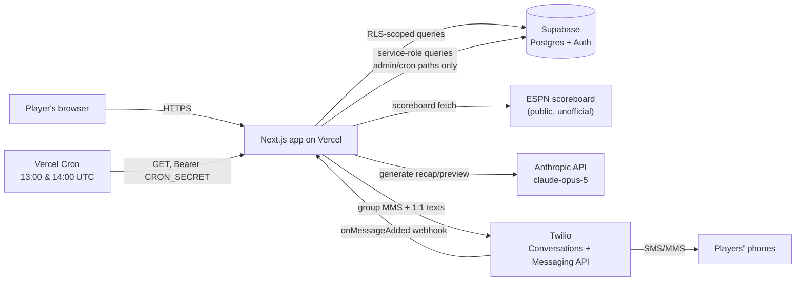

# Gridiron — NFL Over/Unders

A season-long prediction contest for 5 friends, built around a draft of NFL
team win-total over/unders — plus a Claude-written, Twilio-delivered group
text that keeps everyone up to date without anyone opening the site.

## How the contest works

**The draft.** Before the season, every NFL team is assigned a win-total
line (e.g. Chiefs 10.5). Each team offers two draftable picks: **Over** and
**Under**. The 5 players take turns in a snake draft for 6 rounds (30 picks
total). Once a player takes "Chiefs Over," no one else can take it — but
"Chiefs Under" is still open for anyone, including the same player. Picks
are for a specific team *and* side, so most of the 64 possible (team, side)
slots go undrafted; only the 30 that get picked matter.

**Scoring a pick.** After the season, each drafted pick is checked against
the team's actual win total:
- Correct side: **1 point**
- Bonus: **+0.5 points per full win of margin** beyond the line, capped at
  **+3 bonus points** (so a blowout season can't run away with the pool)
- Wrong side: **0 points**, no penalty

Since every line is a half-number (x.5), there are no pushes — every pick
resolves cleanly.

**Division bonus.** Separately from the draft, each player predicts the
winner of all 8 NFL divisions (AFC/NFC × East/North/South/West) before
Week 1. Each correct prediction is worth **1 point** (8 max) — intentionally
worth less than the draft so it stays a bonus, not a second contest.

**Tiebreaker.** Each player also submits a guess for the total points
scored across all regular-season games (all 272 games, playoffs excluded).
If the overall standings are tied at the end of the season, the closest
guess wins. If guesses are equidistant, the tie stands as a shared tie.

**Final score** = sum of all draft pick points + division bonus points.
The tiebreaker only applies if two or more players are tied at the top.

---

## Architecture

### Stack

| Layer | Choice |
|---|---|
| Framework | [Next.js](https://nextjs.org) App Router, TypeScript, server components + server actions |
| Database, Auth, RLS | [Supabase](https://supabase.com) (Postgres) |
| Styling | [Tailwind CSS](https://tailwindcss.com) |
| Recap/preview text generation | [Anthropic API](https://docs.claude.com) — `claude-opus-5` |
| Group text delivery | [Twilio Conversations](https://www.twilio.com/docs/conversations) (group MMS) + Twilio Messaging API (1:1) |
| Score data | ESPN's public (unofficial) scoreboard endpoint |
| Hosting | [Vercel](https://vercel.com), including Vercel Cron |

### System overview



### Auth & authorization

- Email/password auth via Supabase Auth. `handle_new_user` (a trigger on
  `auth.users`) creates the matching `profiles` row on signup.
- Nearly every table is readable by any signed-in player — it's a 5-person
  pool, there's no reason to hide anyone's picks from each other. Writes are
  gated per-table, either to the row's own owner (`auth.uid() = id`/`user_id`)
  or to the commissioner (`is_commissioner()`, a small RLS helper function).
- `profiles.is_commissioner`, `profiles.is_demo`, and
  `profiles.sms_opted_out_at` are "privileged" columns: a `before update`
  trigger (`protect_privileged_profile_columns`) silently reverts any change
  a signed-in user makes to them directly, since the general "users can
  update their own profile" policy would otherwise let anyone self-promote
  to commissioner or clear their own opt-out. Service-role writes (used by
  server code, e.g. the opt-out webhook) bypass this — the trigger only
  fires for the `authenticated` role.
- **Demo mode**: a real `profiles` row with `is_demo = true`, not a
  synthetic session. Every page branches on `profile.is_demo` and serves
  static fixture data (`src/lib/demo/data.ts`) instead of querying Supabase;
  every mutating server action independently rejects demo accounts
  server-side, so a demo user can't write real data even by calling an
  action directly.
- `src/proxy.ts` (Next.js middleware) + `src/lib/supabase/proxy.ts` refresh
  the auth session cookie on every request and redirect signed-out visitors
  to `/login`, except for `/login`, `/privacy`, `/terms`, and everything
  under `/api/` (API routes do their own auth check per-route).

### Data model

| Table | Purpose |
|---|---|
| `profiles` | One row per player: display name, email, phone, commissioner/demo flags, SMS opt-out state |
| `teams` | The 32 NFL teams, each with a `win_total_line` |
| `games` | Synced from ESPN; team records and the league-wide point total are both derived from this, not stored separately |
| `draft_sessions` / `draft_picks` | The single 6-round snake draft; a pick is `(team, side)`, not just a team |
| `division_predictions` / `division_winners` | Each player's division picks, and the commissioner-recorded actual winners |
| `tiebreaker_predictions` | Each player's total-points guess |
| `app_settings` | Generic key/value store — see below |
| `sent_messages` | Audit trail of every text actually sent (kind, target, full body, timestamp) — commissioner-readable only |

Derived, read-only SQL views (see `supabase/migrations/0001_init.sql`):
`team_records`, `league_total_points`, `draft_pick_scores`,
`overall_leaderboard` (excludes demo accounts — `0004`).

`app_settings` keys in use:

| Key | Set by | Meaning |
|---|---|---|
| `sms_conversation_sid` | `/admin` "Create SMS group text" | The Twilio Conversation backing the group thread |
| `weekly_recap_tone` | `/admin` "Text tone" | Which tone preset Claude writes recap/preview texts in |
| `last_weekly_summary_week` | sync job | Last week a recap was sent for (send-once guard) |
| `last_weekly_preview_week` | sync job | Last week a preview was sent for (send-once guard) |
| `last_synced_at` | sync job | Timestamp of the last successful ESPN fetch, shown on Leaderboard/Standings/Admin |

Migrations are numbered and applied in order — see `supabase/migrations/`.
There's no automated migration runner for this repo; apply each new
migration's SQL by hand in the Supabase SQL editor when it's added.

### Score sync pipeline

`src/app/api/sync/games/route.ts` does the work; it's reachable two ways:

- **`GET`**, with `Authorization: Bearer $CRON_SECRET` — Vercel Cron. Vercel
  Cron on the Hobby plan only guarantees an invocation *somewhere within*
  the scheduled hour, not the exact minute, and can't run more than once a
  day per job — so `vercel.json` schedules the route twice (`13:00` and
  `14:00` UTC, the two UTC hours 9am can fall on across the EDT/EST
  boundary), and the route itself checks the *live* local hour in
  `America/New_York` and no-ops unless it's genuinely the 9am hour there.
  Whichever of the two invocations actually lands in that hour does the
  real work; the other is a cheap no-op. This self-corrects across the DST
  changeover with no manual schedule flip.
- **`POST`**, from a signed-in commissioner — the "Sync scores now" button
  on `/admin`. Not subject to the 9am gate; runs immediately.

Once running, it fetches ESPN's scoreboard for a ±9-day window, computes
each game's NFL week from its own kickoff time, and upserts by ESPN's event
`id` (safe to re-run; later syncs just update scores/status in place).

**Week computation** (`computeNflWeek`, `src/lib/domain/season.ts`) compares
each kickoff's **America/New_York calendar date** against the season's
Tuesday-anchored start date — not a raw UTC timestamp diff. NFL weeks run
Tuesday-to-Monday in Eastern time; a late Monday-night game (8pm+ ET) is
already past midnight UTC, so a naive UTC-instant comparison would
misclassify it into the following week. Comparing ET calendar dates avoids
that, and is also immune to daylight saving's 23/25-hour days.

Every successful fetch (regardless of whether any games actually changed)
records `last_synced_at` in `app_settings`, which is what Leaderboard,
Standings, and `/admin` display.

### Scoring & derived data

`scorePick()` (`src/lib/domain/scoring.ts`) implements the point formula
described above and is mirrored by the `draft_pick_scores` SQL view — the
two are kept in sync by hand if the formula ever changes. `projectedWins`/
`projectedLeaguePoints` compute the display-only "on pace for N" figures
used on Standings and Leaderboard; they're never used for actual scoring,
which always waits for a team's real final record.

### Notifications

**Group MMS setup.** The commissioner creates one Twilio Conversation per
season from `/admin`, once every player has a phone number on file. Each
real player joins as an `Address`-only participant (their own phone
number); one additional "unattached" `ProjectedAddress`-only participant
represents the app's own sending identity — without it, Twilio rejects
every outbound message with error 50513 ("message author should be among
group MMS participants"), since every message's `Author` has to match a
real participant. See `src/lib/notify/sms.ts` and
`src/app/api/admin/sms/setup/route.ts`.

**Automatic texts:**
- Draft starts, each pick, draft completes (`src/app/api/draft/start`,
  `.../draft/pick`)
- **Weekly recap** — the morning after an NFL week is fully final, Claude
  writes a title (`Week N Recap`, generated in code, not by the model) plus
  2-4 bullet points calling out drafted teams' meaningful results, in
  whatever tone the commissioner picked. Falls back to a plain scoring-pace
  line if `ANTHROPIC_API_KEY` isn't set or generation fails.
- **Weekly preview** — on the upcoming week's actual first game day
  (computed from real synced kickoff data, not a hardcoded weekday, so it
  adapts to Thursday openers, Thanksgiving, international games, etc.),
  Claude previews that week's drafted-team matchups in the same tone.

Both texts are idempotent per week via the `app_settings` keys above, so
the once-a-day sync job can check every run without double-sending.
Generation uses `output_config: { effort: "low" }` with enough `max_tokens`
headroom for Opus 5's default adaptive thinking; a response that still hits
the token cap is discarded rather than sent truncated.

**Tone.** Four presets — Nice, Playful, Snarky, Brutal — stored as one
`app_settings` value and applied to both the recap and the preview
(`src/lib/notify/weekly-recap.ts`). Adjustable any time from `/admin`.

**Message log.** Every text `sendGroupText`/`sendDirectText` actually sends
is logged to `sent_messages` (kind, target, full body, timestamp) —
commissioner-only, shown on `/admin` under "Message log", so there's a
record beyond someone's actual phone.

**Opt-outs.** `src/app/api/twilio/inbound/route.ts` receives Twilio
Conversations' `onMessageAdded` webhook; a STOP-family reply sets
`profiles.sms_opted_out_at`, a START-family reply clears it. Auth is a
shared secret in the webhook URL's query string rather than full
request-signature validation. Twilio blocks delivery to an opted-out number
at the carrier level regardless of whether this webhook is even configured
— it only makes that state visible in the app.

**Admin test matrix.** `/admin`'s "Message log" section can send a
Recap, Preview, or plain connectivity test to either the commissioner's own
phone or the real group thread, on demand — the same generation/send code
paths as the automated jobs, useful for previewing tone changes or
verifying Twilio wiring without waiting for a real game day.

### Admin tooling

`/admin` (commissioner-only) is a set of collapsible sections
(`src/app/admin/section.tsx`, native `<details>`/`<summary>` — no client JS
needed): Participants, Scores (sync status + manual trigger), Group text
(setup + message tests), Text tone, Message log, Draft controls, Win-total
lines, Division winners.

---

## Project structure

```
src/
  app/
    page.tsx                    Home — live season status banner + rules
    login/                      Sign in / sign up
    profile/                    Edit display name, email, phone/SMS opt-in
    draft/                      Live draft board
    leaderboard/                Overall standings + everyone's picks
    my-picks/                   A player's picks, division call, tiebreaker
    standings/                  Live NFL team records vs. win-total lines
    admin/                      Commissioner tools (collapsible sections)
    privacy/, terms/            Static pages (required for Twilio A2P review)
    api/
      draft/start/              Commissioner: start the draft
      draft/pick/                Make a draft pick
      draft/reset/, undo-last-pick/   Commissioner draft controls
      sync/games/                ESPN sync — cron + manual trigger
      admin/sms/setup/           Commissioner: create the group MMS thread
      admin/sms/test/            Send a connectivity test to self
      admin/sms/test-group/      Send a connectivity test to the group
      admin/sms/test-message/    Send a generated recap/preview to self or group
      twilio/inbound/            Twilio webhook — STOP/START opt-out tracking
  lib/
    supabase/                    Browser/server/service-role Supabase clients
    domain/                      Draft order, scoring math, NFL week math,
                                  sync-status tracking, shared types
    notify/                      Twilio sending, Claude recap/preview generation
    demo/                        Static fixture dataset for the read-only demo account
supabase/
  migrations/                    SQL schema (tables, views, RLS policies), numbered
  seed.sql                       32 NFL teams (name, code, conference, division)
```

## Environment variables

See `.env.local.example` for the full annotated list. Summary:

| Variable | Required for |
|---|---|
| `NEXT_PUBLIC_SUPABASE_URL`, `NEXT_PUBLIC_SUPABASE_ANON_KEY`, `SUPABASE_SERVICE_ROLE_KEY` | Everything |
| `TWILIO_ACCOUNT_SID`, `TWILIO_AUTH_TOKEN`, `TWILIO_PHONE_NUMBER`, `TWILIO_MESSAGING_SERVICE_SID` | Group texting |
| `TWILIO_INBOUND_WEBHOOK_SECRET` | Opt-out tracking (optional — Twilio still blocks delivery without it) |
| `ANTHROPIC_API_KEY` | Claude-generated recap/preview text (optional — falls back to a plain line) |
| `CRON_SECRET` | Authorizing Vercel Cron's daily sync call |

## Getting started

```bash
npm install
cp .env.local.example .env.local  # fill in your Supabase project values
npm run dev
```

Open [http://localhost:3000](http://localhost:3000) to see the app.

## Deploying

1. Apply every migration in `supabase/migrations/`, in order, via the
   Supabase SQL editor (no automated runner — copy/paste each file).
2. Deploy to Vercel; set the environment variables above.
3. `vercel.json` registers the sync cron automatically on deploy — no
   further setup needed there. For opt-out tracking, separately configure
   the Twilio Conversations webhook as described in
   `.env.local.example`/`src/app/api/twilio/inbound/route.ts`.
